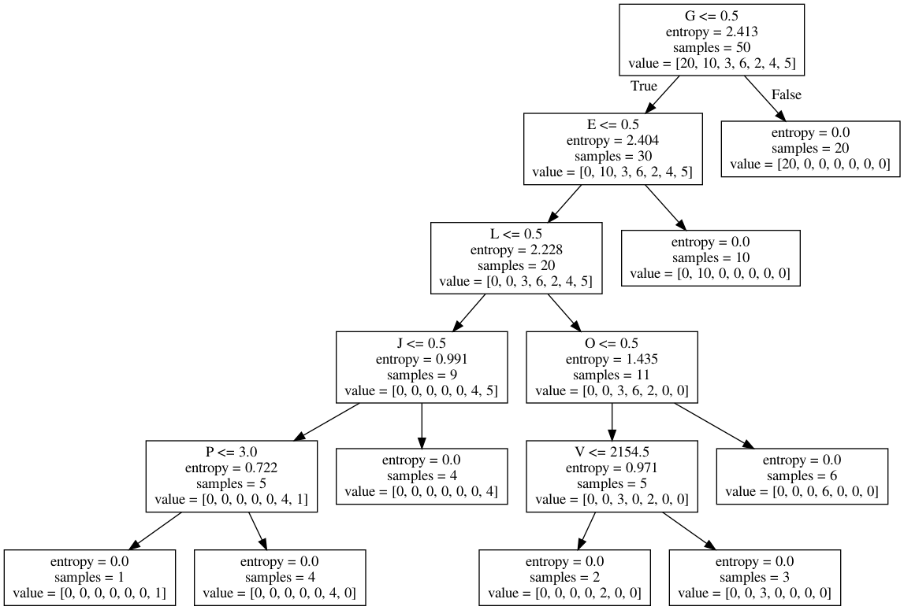

Tigran SLAMA


D'apres les dire du client et cette matrice, j'en déduis que:
  - On souhaite apprendre Z
  - Les champs  F, G, I, L, N, Q sont importants, en effet, 
  ils ne sont pas dans la moyenne des autres resultats de Z.

Je vais essayer de mettre en place les trois algorithmes d'apprentissage suivants: 
  - K voisins 
  - Arbre de décision
  - Reseau de neuronnes

Je choisi ces algorithmes car nos données sont discrètes, et ces algorithmes s'y adaptent.

## Résultats préliminaires
### K voisins
 ```
train : 0.72
test : 0.7450980392156863
[[21  0  0  0  0  0  0]
 [ 0 10  0  0  0  0  0]
 [ 0  2  0  0  0  0  0]
 [ 0  7  0  0  0  0  0]
 [ 0  0  0  2  0  0  0]
 [ 0  0  0  0  0  4  0]
 [ 0  0  0  0  0  2  3]]
 ```

### Neural Network
 ```
train : 0.86
test : 0.8235294117647058
[[21  0  0  0  0  0  0]
 [ 0  7  0  3  0  0  0]
 [ 0  1  0  1  0  0  0]
 [ 0  0  0  7  0  0  0]
 [ 0  0  0  2  0  0  0]
 [ 0  0  0  0  0  4  0]
 [ 0  0  0  0  0  2  3]]
 ```

### Arbre de décision
 ```
train : 0.9
test : 0.803921568627451
[[21  0  0  0  0  0  0]
 [ 0  5  0  5  0  0  0]
 [ 0  2  0  0  0  0  0]
 [ 0  0  1  6  0  0  0]
 [ 0  0  0  1  1  0  0]
 [ 0  0  0  0  0  4  0]
 [ 0  0  0  0  0  1  4]]
 ```

Les resultats en choissant les 7 colonnes les plus corélées et les moins
corélées à Z. Ils ne sont pas mauvais, mais ils pourraient être meilleurs,
notamment pour les K voisins.

## Résultats finaux

En gardant les champs D, G, K, L, M, Q, S; les plus corelés à Z, on obtient des
résultats plutot satisfaisants.

### K voisins
``` 
test : 0.9411764705882353
[[21  0  0  0  0  0  0]
 [ 0 10  0  0  0  0  0]
 [ 0  0  1  1  0  0  0]
 [ 0  0  0  7  0  0  0]
 [ 0  0  1  0  1  0  0]
 [ 0  0  0  0  0  4  0]
 [ 0  1  0  0  0  0  4]]
 ```

### Neural Network
 ```
train : 0.94
test : 0.9411764705882353
[[21  0  0  0  0  0  0]
 [ 0 10  0  0  0  0  0]
 [ 0  0  1  1  0  0  0]
 [ 0  0  0  7  0  0  0]
 [ 0  0  1  0  1  0  0]
 [ 0  0  0  0  0  4  0]
 [ 0  1  0  0  0  0  4]]
 ```
### Arbre de décision
 ```
train : 0.92
test : 0.9607843137254902
[[21  0  0  0  0  0  0]
 [ 0 10  0  0  0  0  0]
 [ 0  0  2  0  0  0  0]
 [ 0  0  0  7  0  0  0]
 [ 0  0  0  0  2  0  0]
 [ 0  0  0  0  0  4  0]
 [ 0  1  0  0  0  1  3]]
 ```
L'algorithme génère l'arbre suivant.


L'arbre de décision semble être le plus efficace de tous.

## Vérification si le client a raison avec le champ Q.

### K voisins
 ```
train : 0.9
test : 0.9215686274509803
[[21  0  0  0  0  0  0]
 [ 0 10  0  0  0  0  0]
 [ 0  0  2  0  0  0  0]
 [ 0  0  0  7  0  0  0]
 [ 0  0  2  0  0  0  0]
 [ 0  0  0  0  0  4  0]
 [ 0  0  0  0  0  2  3]]
 ```

### Neural Network
 ```
train : 0.94
test : 0.8823529411764706
[[21  0  0  0  0  0  0]
 [ 0 10  0  0  0  0  0]
 [ 0  1  0  1  0  0  0]
 [ 0  0  0  7  0  0  0]
 [ 0  0  2  0  0  0  0]
 [ 0  0  0  0  0  4  0]
 [ 0  0  0  0  0  2  3]]
 ```

### Arbre de decision
 ```
train : 0.9
test : 0.9215686274509803
[[21  0  0  0  0  0  0]
 [ 0 10  0  0  0  0  0]
 [ 0  1  1  0  0  0  0]
 [ 0  0  0  7  0  0  0]
 [ 0  0  2  0  0  0  0]
 [ 0  0  0  0  0  4  0]
 [ 0  0  0  0  0  1  4]]
 ```

Le client semble avoir raison, le champ Q semble plutot important.
